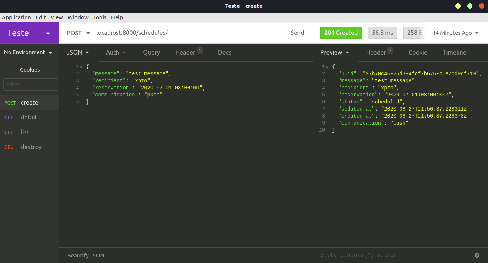
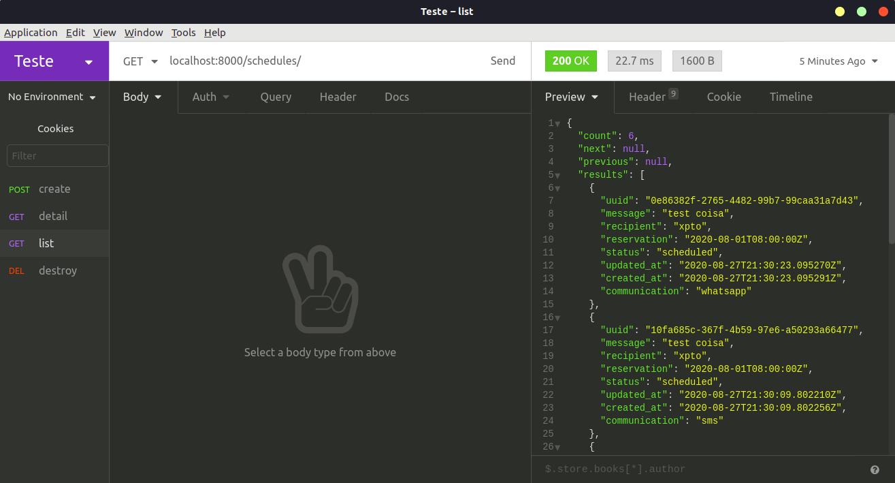
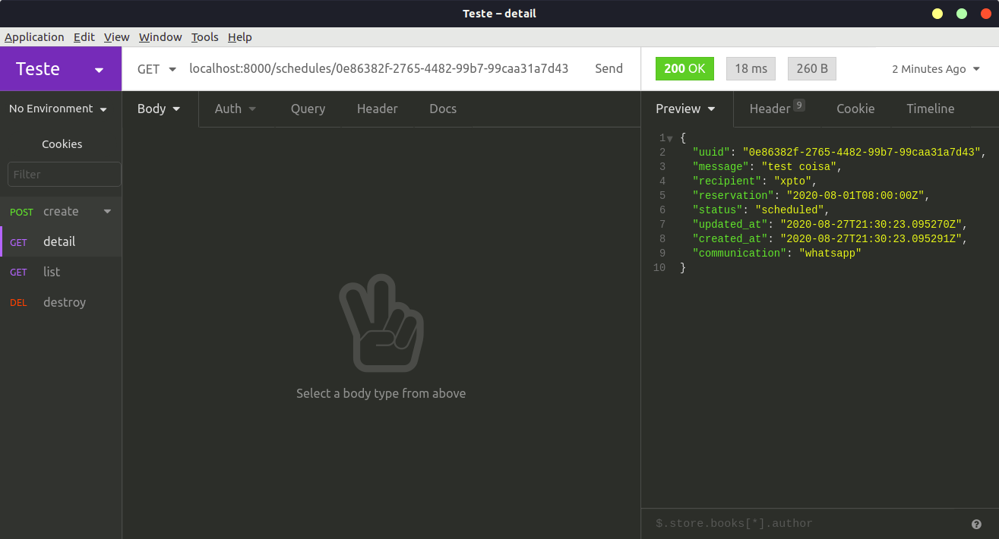
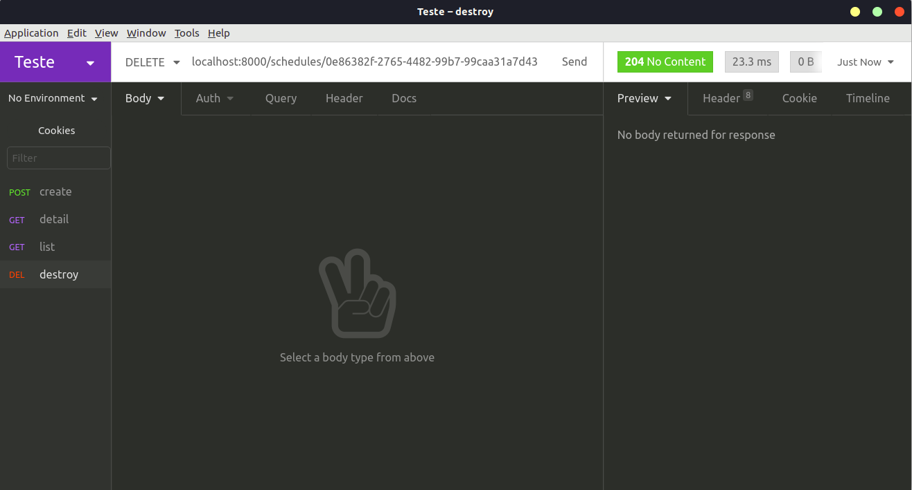

# communication-api

This API is responsible to retrieve, create and delete schedules.


## Getting Started

These instructions will get you a copy of the project up and running on your local machine for development and testing purposes.

## Prerequisites

``` bash
    python version [3.6.8]
    pyenv / virtualenv
    python-pycurl
    libgnutls-dev
    docker
```

## Installation

How to install the prerequisites:
```bash
$ sudo apt-get update
$ sudo apt-get install python3.6.8
$ sudo apt-get install python-pycurl
$ sudo apt-get install libgnutls-dev
```
To install docker you can see on this links:
```
Ubuntu:
https://docs.docker.com/engine/install/ubuntu/

Windows:
https://docs.docker.com/docker-for-windows/install/

MacOs:
https://docs.docker.com/docker-for-mac/install/
```

We are using Ubuntu so let's start:

```
$ sudo apt-get update
$ sudo apt-get install docker-ce docker-ce-cli containerd.io
```

Create a virtualenv (using `pyenv`):
```bash
$ pyenv install [version]
$ pyenv global [version]
$ pyenv virtualenv [version] communication
$ pyenv activate communication
```

Then you should source the environment variables file:
```bash
(communication)$ source .communicationrc
```

Now we have to set up the database(MySql) with docker:
```
(communication)$ docker-compose up -d
```

Install development requirements:
```bash
(communication)$ make dependencies
```

## Running the tests

To run the test suite, execute:
```bash
(communication)$ make test
```

To show coverage details (in HTML), use:
```bash
(communication)$ make coverage
```

## Running the Application
Migrations
```
(communication)$ make migrate
```

Application
```
(communication)$ make run
```

## Import this collection in your Postman
[Collection](docs/Insomnia_2020-08-27.json)


## Methods
#### POST


`localhost:8000/schedules/`
```json
{
	"message": "test message",
	"recipient": "xpto",
	"reservation": "2020-07-01 08:00:00",
	"communication": "push"
}
```

to create a schedule, just post with the payload above.

#### GET


`localhost:8000/schedules/`

It will list all schedules

#### RETRIEVE


`localhost:8000/schedules/<uuid>`

Use the uuid create before to return the schedule.

#### DELETE


`localhost:8000/schedules/<uuid>`

Use the uuid to delete the schedule.
The response is blank, but it will returns a 204 status code
